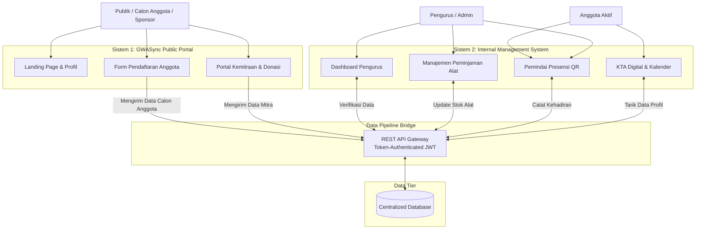
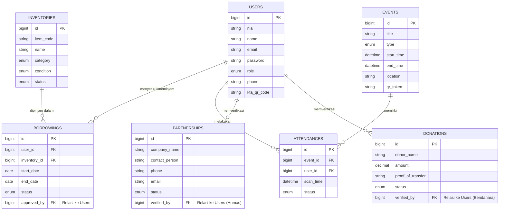

# IMPLEMENTATION PLAN — GWASync

## System Overview

### Background / Latar Belakang
Manajemen operasional UKM Marching Band Gita Widya Agni saat ini masih menghadapi kendala desentralisasi data:
* Informasi publik dan profil UKM belum terintegrasi langsung dengan penerimaan anggota baru.
* Rekap kehadiran latihan anggota masih dicatat manual dan rentan hilang/manipulasi.
* Peminjaman alat/inventaris belum terdata secara tersentralisasi dan masih menggunakan input manual (dicatat di HP/Dikertas), sehingga pendataan dan pelacakan alat masih sering tumpang tindih.
* Pengelolaan data kemitraan, transparansi program kerja, donasi, serta kartu tanda anggota masih berjalan parsial tanpa sistem terpusat.

### System Objectives / Tujuan Sistem
Membangun platform terpadu berbasis web yang mencakup:
* **Sistem 1 GWASync Publik Portal:** Web profil interaktif, media publikasi prestasi/kegiatan, program kerja tahunan, pengajuan kerjasama mitra/sponsor, konfirmasi donasi, dan formulir pendaftaran anggota baru.
* **Sistem 2 Internal Management System (Multi-Panel):** Pusat komputasi operasional pengurus dan anggota yang mencakup verifikasi registrasi pendaftaran, logistik alat marching band, presensi latihan berbasis QR, Calendar of Event internal, dan Kartu Tanda Anggota (KTA) Digital.
* **Data Pipeline Bridge:** Integrasi otomatis pengiriman data pendaftar dari Sistem 1 ke Sistem 2 secara aman via REST API (Token-authenticated).

---

## System Architecture

## Scope & Constraints / Batasan Sistem

### In-Scope (Fitur yang Dikerjakan)

**Sistem 1 (Public Portal):**
* **Landing Page & Profile:** Halaman profil publik, visi-misi, sejarah, struktur kepengurusan, dan etalase galeri kegiatan/prestasi lomba.
* **Showcase Program Kerja:** Menampilkan daftar program kerja aktif MBGWA beserta linimasa pelaksanaannya.
* **Pendaftaran Online (Open Recruitment):** Formulir pendaftaran calon anggota multi-langkah (step-wizard) dengan validasi data dan upload berkas identitas.
* **Open Kerjasama Mitra:** Formulir pengajuan sponsorship/kolaborasi dan tautan unduh Proposal/Partnership Deck.
* **Open Donation:** Informasi rekening bank dan barcode QRIS resmi dengan formulir konfirmasi pengiriman bukti donasi.
* **API Dispatcher:** Pengiriman otomatis data pendaftar, mitra, dan donasi ke Sistem 2.

**Sistem 2 (Internal Management System):**
* **Verifikasi Humas Diklat:** Antrean pendaftaran masuk, review berkas, approval satu tombol yang otomatis membuat akun user dan profil anggota.
* **Sistem Absensi Latihan:** Pembuatan agenda sesi latihan rutin/TC, dynamic QR token, presensi mandiri anggota via scan kamera, input manual oleh pengurus, serta ekspor rekapitulasi kehadiran (Excel/PDF).
* **Peminjaman Alat (Sarpras):** Master katalog inventaris alat marching band (Brass, Battery, Pit Instrument, Guard, Properti), pengajuan pinjam alat oleh anggota, validasi approval, serta inspeksi kondisi fisik alat (before/after).
* **Kartu Tanda Anggota (KTA) Digital:** Tampilan kartu identitas digital interaktif di portal anggota dilengkapi QR Code unik dan foto profil.
* **Calendar of Event (Khusus Internal):** Kalender interaktif jadwal latihan, TC, gladi, rapat, dan kejuaraan bagi pengurus dan anggota.
* **Manajemen Kemitraan & Donasi:** Pipeline pengelolaan prospek sponsor masuk dan verifikasi pencatatan donasi oleh bendahara.

### Out-Scope (Fitur yang TIDAK Dikerjakan)
* **Aplikasi Mobile Native:** Tidak membuat aplikasi Android (.apk) atau iOS (.ipa) di Play Store; sistem murni berbasis Web Responsif.
* **Payment Gateway Otomatis:** Pembayaran uang kas atau biaya pendaftaran tidak terintegrasi otomatis ke Midtrans/Xendit (masih menggunakan transfer manual dan upload bukti transfer ke bendahara).
* **Fitur Chatting Internal:** Tidak membuat sistem chat/pesan antar-anggota (koordinasi tetap via grup WhatsApp).

---

## Functional Specifications (Spesifikasi Fitur & Alur Kerja)

### Feature List

**Sistem 1: GWASync Public Portal**
* **Modul Profil & Publikasi:** Menampilkan sejarah, visi-misi, susunan pengurus, dan galeri prestasi.
* **Modul Pendaftaran (Oprec):** Formulir digital untuk calon anggota baru dengan validasi format (email, nomor HP) dan fitur unggah berkas (foto/KTM).
* **Modul Kemitraan & Donasi:** Halaman khusus berisi Company Profile, tombol unduh proposal sponsorship, dan form konfirmasi transfer donasi.

**Sistem 2: Internal Management System**
* **Modul Autentikasi & Akun:** Login portal menggunakan kredensial (NIA dan Password), terhubung dengan KTA Digital.
* **Modul Dashboard Pengurus:** Panel ringkasan statistik (jumlah anggota aktif, persentase kehadiran, status alat).
* **Modul Inventaris & Peminjaman (Logistik):** Pencatatan real-time ketersediaan alat musik dan seragam. Dilengkapi form peminjaman/pengembalian alat dengan status approval dan riwayat (log) peminjam.
* **Modul Presensi Berbasis QR:** Generator QR Code dinamis untuk setiap jadwal latihan. Anggota memindai menggunakan KTA Digital mereka.
* **Modul Calendar of Event:** Penjadwalan internal untuk latihan rutin, TC (Training Center), dan kompetisi.

### User Flow / Page Architecture
Desain antarmuka internal difokuskan pada tata letak vertikal (vertical layout) dengan navigasi berada di sisi kiri (sidebar) agar memudahkan akses cepat antar modul tanpa memakan banyak ruang layar.

**Alur Pengguna (User Flow):**
1. **Publik / Calon Anggota:** Mengakses URL Landing Page (Beranda vertikal bawah) -> Membaca Profil -> Klik "Daftar Sekarang" -> Mengisi Form Oprec -> Mendapat email konfirmasi (Data masuk antrean API).
2. **Anggota Aktif:** Buka URL Internal -> Login -> Masuk ke Dashboard Pribadi -> Membuka KTA Digital (untuk scan QR kehadiran) atau Mengajukan Form Peminjaman Alat -> Logout.
3. **Pengurus (Logistik):** Login -> Sidebar navigasi vertikal -> Pilih Menu "Inventaris" -> Melihat tabel daftar alat -> Menyetujui/menolak pengajuan peminjaman -> Mengubah status alat (Tersedia/Dipinjam/Rusak) -> Update Database.

---

## Role-Based Access Control (RBAC) Matrix

| Modul/Fitur | Ketua Umum | Pengurus (Sarpras) | Pengurus (Humas & Latbang) | Anggota Aktif | Publik (Non-Login) |
| :--- | :---: | :---: | :---: | :---: | :---: |
| **Akses Sistem 1 (Public Portal)** | ✔ | ✔ | ✔ | ✔ | ✔ |
| **Akses Dashboard Internal** | ✔ | ✔ | ✔ | ✔ | ❌ |
| **Verifikasi Pendaftaran** | ✔ | ❌ | ✔ | ❌ | ❌ |
| **Manajemen Master Inventaris**| ✔ | ✔ | ❌ | ❌ | ❌ |
| **Form Peminjaman Alat** | ✔ | ✔ | ❌ | ✔ | ❌ |
| **Generate QR** | ✔ | ❌ | ✔ | ❌ | ❌ |
| **Akses KTA Digital** | ✔ | ✔ | ✔ | ✔ | ❌ |
| **Manajemen User/Role** | ✔ | ❌ | ❌ | ❌ | ❌ |

---

## Technology Stack & Environment

### Sistem 1: GWASync Public Portal
*(Tech stack disesuaikan dengan arsitektur decoupled/pendekatan frontend-specific)*

### Sistem 2: Internal Management System (TALL Stack & Filament)
* **Framework Utama (Back-End):** Menangani seluruh logika bisnis, keamanan (otentikasi & otorisasi berbasis token dengan Laravel Sanctum), pengelolaan database (Eloquent ORM), dan bertindak sebagai penyedia REST API tunggal (API Gateway) untuk Sistem 1 dan Sistem 2.
* **Framework Utama (Front-End):** Vue.js 3 (Composition API).  Menggunakan pendekatan Single Page Application (SPA) murni atau diintegrasikan melalui Inertia.js (jika ingin menghindari pembuatan REST API terpisah dan tetap mempertahankan routing monolitik Laravel).
* **State Management & Interactivity:** Pinia (pengganti Vuex) untuk mengelola state global di sisi klien (seperti menyimpan data profil user yang sedang login atau status cart peminjaman alat), dan Vue Router untuk navigasi antar modul internal secara instan tanpa reload halaman.
* **Styling & UI Components:** Tailwind CSS dikombinasikan dengan library komponen Vue seperti PrimeVue, Vuetify, atau Headless UI. Mempermudah pembuatan tata letak vertikal (sidebar navigation), tabel data (datatable) inventaris, dan dashboard statistik agar tetap rapi, responsif, dan konsisten.
### Database & Storage
* **Relational Database:** MySQL atau PostgreSQL. Sangat kompatibel dengan Eloquent ORM dari Laravel untuk mengelola relasi kompleks antara data Users, Inventory, dan Attendance.
* **Storage:** Local Storage atau Amazon S3 (melalui Laravel Filesystem) untuk menyimpan lampiran berkas pendaftaran (KTM/Foto) dan dokumen sponsorship.

### Environment & Deployment
* **Version Control:** Git & GitHub
* **Hosting / Server:** VPS (Virtual Private Server) berbasis Linux (Ubuntu). Bisa dikelola menggunakan server management tool seperti Laravel Forge atau dikonfigurasi manual dengan Nginx, PHP-FPM, dan Composer.

---

## Data Architecture & Database Schema

### Entity Relationship Diagram (ERD)

### Table Definitions & Data Dictionary

#### Tabel: `users`
Menyimpan data otentikasi dan profil, baik untuk calon anggota baru maupun anggota aktif yang telah memiliki Nomor Induk Anggota (NIA).

| Column Name | Data Type | Modifiers | Description |
| :--- | :--- | :--- | :--- |
| `id` | `bigint` | Primary Key, Auto Increment | ID unik pengguna |
| `nia` | `varchar(20)` | Unique, Nullable | Nomor Induk Anggota (kosong untuk calon anggota) |
| `name` | `varchar(100)` | Not Null | Nama lengkap pengguna |
| `email` | `varchar(100)` | Unique, Not Null | Email untuk login & notifikasi |
| `password` | `varchar(255)` | Not Null | Password (terenkripsi *hash*) |
| `role` | `enum` | Not Null | `ketua_umum`, `pengurus`, `anggota`, `calon` |
| `phone` | `varchar(15)` | Nullable | Nomor WhatsApp/HP yang aktif |
| `kta_qr_code` | `varchar(255)` | Nullable | Path gambar atau *string hash* QR Code KTA |
| `created_at` | `timestamp` | Nullable | Waktu registrasi otomatis |
| `updated_at` | `timestamp` | Nullable | Waktu *update* terakhir |

#### Tabel: `inventories`
Master data untuk logistik alat marching band dan properti.

| Column Name | Data Type | Modifiers | Description |
| :--- | :--- | :--- | :--- |
| `id` | `bigint` | Primary Key, Auto Increment | ID unik inventaris |
| `item_code` | `varchar(50)` | Unique, Not Null | Kode alat (misal: `BRS-001`, `BTY-012`) |
| `name` | `varchar(150)` | Not Null | Nama alat (misal: Mellophone, Snare Drum) |
| `category` | `enum` | Not Null | `Brass`, `Battery`, `Pit_Instrument`, `Guard`, `Properti` |
| `condition` | `enum` | Default: `Baik` | Kondisi fisik: `Baik`, `Rusak Ringan`, `Rusak Berat` |
| `status` | `enum` | Default: `Tersedia` | Ketersediaan: `Tersedia`, `Dipinjam`, `Maintenance` |

#### Tabel: `borrowings`
Mencatat riwayat (log) peminjaman inventaris oleh anggota beserta status persetujuan dari pengurus logistik/sarpras.

| Column Name | Data Type | Modifiers | Description |
| :--- | :--- | :--- | :--- |
| `id` | `bigint` | Primary Key, Auto Increment | ID transaksi peminjaman |
| `user_id` | `bigint` | Foreign Key | Merujuk ke `users.id` (Peminjam) |
| `inventory_id` | `bigint` | Foreign Key | Merujuk ke `inventories.id` |
| `start_date` | `date` | Not Null | Tanggal mulai meminjam |
| `end_date` | `date` | Not Null | Rencana tanggal pengembalian |
| `status` | `enum` | Default: `Pending` | `Pending`, `Disetujui`, `Ditolak`, `Dikembalikan` |
| `approved_by` | `bigint` | Foreign Key, Nullable | Merujuk ke `users.id` (Admin/Pengurus yang menyetujui) |

#### Tabel: `events`
Menyimpan *Calendar of Event* internal untuk manajemen jadwal dan pembuatan tiket/QR absen.

| Column Name | Data Type | Modifiers | Description |
| :--- | :--- | :--- | :--- |
| `id` | `bigint` | Primary Key, Auto Increment | ID unik agenda |
| `title` | `varchar(150)` | Not Null | Nama agenda (misal: "Latihan Rutin Seksi Brass") |
| `type` | `enum` | Not Null | `Latihan`, `TC`, `Gladi`, `Kejuaraan`, `Rapat` |
| `start_time` | `datetime` | Not Null | Waktu mulai agenda |
| `end_time` | `datetime` | Not Null | Waktu selesai agenda |
| `location` | `varchar(255)` | Not Null | Tempat pelaksanaan |
| `qr_token` | `varchar(255)` | Unique, Nullable | *String hash* unik yang di-generate untuk di-scan |

#### Tabel: `attendances`
Menyimpan data ketertiban anggota. Karena rekap kehadiran sangat rentan dimanipulasi, tabel ini mengunci waktu *scan* aktual (*timestamp*).

| Column Name | Data Type | Modifiers | Description |
| :--- | :--- | :--- | :--- |
| `id` | `bigint` | Primary Key, Auto Increment | ID rekaman presensi |
| `event_id` | `bigint` | Foreign Key | Merujuk ke `events.id` |
| `user_id` | `bigint` | Foreign Key | Merujuk ke `users.id` |
| `scan_time` | `datetime` | Nullable | Waktu pasti QR di-scan (kosong jika Izin/Alpha) |
| `status` | `enum` | Default: `Alpha` | `Hadir`, `Izin`, `Sakit`, `Alpha` |

#### Tabel: `partnerships`
Mendata prospek masuk dari Portal Publik (Sistem 1) untuk pengajuan *sponsorship*.

| Column Name | Data Type | Modifiers | Description |
| :--- | :--- | :--- | :--- |
| `id` | `bigint` | Primary Key, Auto Increment | ID unik prospek mitra |
| `company_name` | `varchar(150)` | Not Null | Nama instansi/perusahaan calon mitra |
| `contact_person` | `varchar(100)` | Not Null | Nama perwakilan (PIC) instansi |
| `phone` | `varchar(15)` | Not Null | Nomor telepon PIC |
| `email` | `varchar(100)` | Not Null | Email instansi |
| `status` | `enum` | Default: `Prospek` | `Prospek`, `Negosiasi`, `Deal`, `Ditolak` |

#### Tabel: `donations`
Mencatat konfirmasi transfer dari donatur publik.

| Column Name | Data Type | Modifiers | Description |
| :--- | :--- | :--- | :--- |
| `id` | `bigint` | Primary Key, Auto Increment | ID unik donasi |
| `donor_name` | `varchar(100)` | Not Null | Nama donatur atau "Hamba Allah" (Anonim) |
| `amount` | `decimal(15,2)` | Not Null | Nominal donasi |
| `proof_of_transfer`| `varchar(255)` | Not Null | Direktori/Path lokal file bukti transfer (gambar/PDF) |
| `status` | `enum` | Default: `Pending` | `Pending` (menunggu cek Bendahara), `Terverifikasi` |
